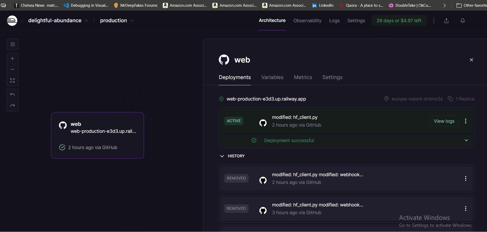

# 🤖 Telegram AI Bot

A versatile Telegram bot powered by Hugging Face models that can run both locally (with polling) and in production (with webhooks). The bot uses state-of-the-art language models to provide intelligent responses to user messages.

## ✨ Features

- **Dual Operation Modes**: Local polling for development & webhooks for production
- **Hugging Face Integration**: Leverages powerful language models like Gemma, Flan-T5, and more
- **Smart Caching**: In-memory caching to optimize response times
- **Easy Deployment**: Ready for platforms like Railway, Heroku, or any cloud provider
- **FastAPI Backend**: Modern, async web framework for high performance

## 🎥 Demo


*Live demonstration of the bot responding to user queries*




*Live demonstration of the Railway deployment*

## 🛠 Tech Stack

- **Python** with FastAPI & Uvicorn
- **python-telegram-bot** library
- **Hugging Face** Inference API
- **OpenAI-compatible** client for model routing
- **Environment-based** configuration

## 📁 Project Structure

```
telegram-ai-bot/
├── assets/
│   └── images/
│       ├── telebot_gif.gif          # Telegram interaction demo
│       └── railway_telebot.gif      # Deployment process demo
├── webhook_app.py
├── tele_bot_polling.py
├── hf_client.py
├── requirements.txt
├── Procfile
├── .env.example
├── .gitignore
└── set_webhook.sh
```

## 🚀 Quick Start

### Prerequisites

- Python 3.8+
- Telegram Bot Token ([Get from @BotFather](https://t.me/BotFather))
- Hugging Face API Token ([Get from HF](https://huggingface.co/settings/tokens))

### Local Development

1. **Clone and setup**:
```bash
git clone <your-repo-url>
cd telegram-ai-bot
```

2. **Install dependencies**:
```bash
pip install -r requirements.txt
```

3. **Configure environment**:
```bash
cp .env.example .env
# Edit .env with your tokens
```

4. **Run polling bot (local)**:
```bash
python tele_bot_polling.py
```

### Production Deployment

1. **Deploy to Railway/Render/Heroku**:
   - Connect your GitHub repository
   - Set environment variables in dashboard:
     - `TELEGRAM_TOKEN`
     - `HF_API_TOKEN` 
     - `HF_MODEL` (optional)

2. **Set webhook**:
```bash
chmod +x set_webhook.sh
./set_webhook.sh https://your-app-url.com
```

## ⚙️ Configuration

### Environment Variables

| Variable | Description | Example |
|----------|-------------|---------|
| `TELEGRAM_TOKEN` | Your Telegram bot token | `123456:ABC-DEF...` |
| `HF_API_TOKEN` | Hugging Face API token | `hf_xxx...` |
| `HF_MODEL` | Model to use (optional) | `google/gemma-2-2b-it` |

### Supported Models

The bot works with any model supported by Hugging Face's router. Default models include:
- `google/gemma-2-2b-it:nebius` (default)
- `google/flan-t5-small`
- Or any model from Hugging Face Hub

## 🌐 API Endpoints

- `GET /health` - Health check
- `GET /debug_env` - Debug environment variables  
- `POST /telegram_webhook` - Telegram webhook endpoint

## 🔧 Development

### Running Locally
```bash
# Development mode (polling)
python tele_bot_polling.py

# Production mode (webhook)  
uvicorn webhook_app:app --host 0.0.0.0 --port 8000
```

### Testing Webhooks Locally
Use ngrok to test webhooks locally:
```bash
ngrok http 8000
./set_webhook.sh https://your-ngrok-url.ngrok.io
```

## 📦 Deployment

### Railway (Recommended)
1. Fork this repository
2. Create new project on [Railway](https://railway.app)
3. Connect your GitHub repo
4. Add environment variables
5. Deploy!

### Other Platforms
The app includes a `Procfile` for Heroku/Railway compatibility and can be deployed to any platform supporting Python.

## 🎯 Usage

1. Start a chat with your bot on Telegram
2. Send any message
3. The bot will process it through the AI model and reply

## 🔒 Security Notes

- Never commit your `.env` file
- Keep your tokens secure
- Webhook URLs should use HTTPS in production
- Regular dependency updates recommended

## 🤝 Contributing

1. Fork the project
2. Create a feature branch
3. Commit your changes
4. Push to the branch
5. Open a Pull Request

## 📄 License

This project is open source. Feel free to use and modify as needed.

## 🐛 Troubleshooting

### Common Issues

- **"Bot not responding"**: Check your tokens and webhook URL
- **"Error querying HF"**: Verify Hugging Face token and model availability
- **Port issues**: Ensure `$PORT` environment variable is set on deployment platforms

### Debug Endpoints
Visit `/debug_env` on your deployed app to verify environment variables.

---